<h1 align="center">
   Crypto Analytics and ML Signal Platform
</h1>

<h3 align="center">
  End-to-end Crypto Data Engineering + MLOps Project
</h3>

    
---

<p align="center">
  <i>Built with GCP | BigQuery | dbt | Kestra | Docker | Terraform | GitHub Actions | Looker Studio |  MLflow</i>
</p>

An end-to-end data engineering and MLOps project for crypto market analytics, risk monitoring, and directional signal research.

This repository demonstrates how raw market, derivatives, liquidity, macro, ETF, sentiment, and operational data can be collected, modeled, orchestrated, monitored, and used for conservative ML signal generation on Google Cloud.

> Scope note: this is an analytics and ML signal platform, not a trading bot, not financial advice, and not automated trading infrastructure. The production ML contract remains conservative. Research candidates such as the microstructure/subset9 feature set are kept as manual or research configurations until source coverage and validation evidence are strong enough.

---

## Architecture Overview

The end-to-end architecture is documented in [docs/architecture.md](docs/architecture.md), with the static [Interactive Project Explorer](docs/interactive/index.html) as the visual reviewer guide.


---

## Interactive Project Explorer

Open [docs/interactive/index.html](docs/interactive/index.html) for a static visual guide aimed at recruiters and reviewers. The Overview tab includes a data-driven architecture map backed by `docs/interactive/architecture_map.json`. It uses plain HTML/CSS/JS, requires no backend, npm install, or build step, and complements the deeper architecture notes in [docs/architecture.md](docs/architecture.md).

---

## Project Documentation

> 📑 Project Documentation Hub: https://tanthanh113.github.io/crypto-analysis-project/
> 
> 📚 Documentation site: https://tanthanh113.github.io/crypto-analysis-project/docs/  
> 🧭 Interactive explorer: https://tanthanh113.github.io/crypto-analysis-project/docs/interactive/  
> 📊 dbt docs: https://tanthanh113.github.io/crypto-analysis-project/dbt/ 

> 🗺️ Pipeline diagram [Open editable architecture diagram in diagrams.net](https://app.diagrams.net/#Uhttps%3A%2F%2Fraw.githubusercontent.com%2FTanThanh113%2Fcrypto-analysis-project%2Fmain%2Fdocs%2Finteractive%2Freference%2Farchitecture-main.drawio)

> The `.drawio` source is stored in this repository. Viewers can open and edit their own copy in diagrams.net, but they cannot modify this repository unless they have write access.

## Recommended Reading Path

1. [README.md](README.md)
2. [docs/architecture.md](docs/architecture.md)
3. [docs/interactive/index.html](docs/interactive/index.html)
4. [docs/batch_pipeline.md](docs/batch_pipeline.md)
5. [docs/streaming_pipeline.md](docs/streaming_pipeline.md)
6. [docs/dbt_models.md](docs/dbt_models.md)
7. [docs/ml_mLOps.md](docs/ml_mLOps.md)
8. [docs/kestra_orchestration.md](docs/kestra_orchestration.md)
9. [docs/k8s_gke_runtime.md](docs/k8s_gke_runtime.md)
10. [docs/terraform_infrastructure.md](docs/terraform_infrastructure.md)
11. [docs/ci_cd_gates.md](docs/ci_cd_gates.md)
12. [docs/production_boundaries.md](docs/production_boundaries.md)
13. [docs/repository_map.md](docs/repository_map.md)

This path gives recruiters a quick guided tour and gives technical reviewers a way to go deeper subsystem by subsystem.

---

## What This Project Demonstrates

| Area | What is demonstrated |
| --- | --- |
| Data engineering | Batch ingestion, streaming preparation, layered dbt models, BigQuery marts, data quality and freshness checks |
| Cloud architecture | GCS, BigQuery, BigLake/Iceberg, GKE, Artifact Registry, Cloud SQL-backed Kestra, Terraform-managed infrastructure |
| Orchestration | Kestra flows for raw ingestion, dbt transforms, monitoring, quality checks, ML training, and prediction |
| MLOps | Feature contracts, strategy matrix training, optional MLflow logging, optional Optuna tuning, optional registry loading, promotion gates, artifact fallback |
| CI/CD | GitHub Actions quality checks, Docker build gating, Kestra deploy gating, PR preview flow generation, repo guard checks |
| Analytics | Dashboard-ready marts for market, derivatives, liquidity, macro/ETF, monitoring, and ML quality views |

---

## Tech Stack

| Layer | Tools |
| --- | --- |
| Cloud | Google Cloud Platform |
| Storage | GCS, BigLake/Iceberg, BigQuery |
| Transformation | dbt Core, BigQuery SQL |
| Orchestration | Kestra on GKE |
| Containers | Docker, Google Artifact Registry |
| Infrastructure | Terraform, GKE, Cloud SQL, Workload Identity |
| ML | Python, scikit-learn, LightGBM, optional XGBoost for local research only |
| MLOps | MLflow optional logging, optional MLflow Registry, Optuna optional tuning |
| CI/CD | GitHub Actions |
| Monitoring | dbt monitoring marts, Great Expectations audit flow, pipeline health checks, dashboard tables |

---

## Current Data Coverage Status

The project is not yet a full-coverage market data platform. The most reliable 5-year backfill coverage currently centers on:

1. Binance trades
2. ETF indicators
3. Macro indicators
4. Funding data

Other sources, including stablecoin, liquidation, options, exchange reserve, Reddit/Telegram sentiment, and live taker-pressure context, may be partial, experimental, or not fully live-ready. Model results should be interpreted as research evidence under current source coverage, not as proof of trading edge.

---

## Repository Structure

| Path | Purpose |
| --- | --- |
| [.github/workflows](.github/workflows) | CI/CD workflows for quality checks, Docker images, Kestra deploy, PR gates, cleanup |
| [.github/scripts](.github/scripts) | GitHub Actions helper scripts such as Kestra deploy planning and flow sync |
| [local_scripts/batch](local_scripts/batch) | Batch collectors, validation, quality audit, monitoring, alerting, backfill helpers |
| [local_scripts/streaming](local_scripts/streaming) | Streaming producers and Flink/Kafka-related local pipeline files |
| [dbt_transform/crypto_dbt](dbt_transform/crypto_dbt) | dbt project with staging, intermediate, core, dashboard, ML, and monitoring marts |
| [kestra/flows-gke](kestra/flows-gke) | GKE-oriented Kestra flows for raw, dbt, ML, monitoring, quality, preview, and master orchestration |
| [ml](ml) | Training, prediction, feature contract, MLflow/Optuna/registry utilities, promotion gate, local research tools |
| [docker](docker) | Production Dockerfiles for batch, dbt, and ML images |
| [terraform](terraform) | Main GCP infrastructure definitions |
| [terraform-bootstrap](terraform-bootstrap) | Bootstrap IAM/service-account setup |
| [terraform-grafana](terraform-grafana) | Grafana-related infrastructure artifacts |
| [helm](helm) and [k8s](k8s) | Kestra Helm values and Kubernetes support manifests |
| [scripts](scripts) | Repository guard and operational helper scripts |
| [docs](docs) | Architecture, pipeline, orchestration, MLOps, runbook, and repository documentation |

See [docs/repository_map.md](docs/repository_map.md) for a folder-by-folder guide.

---

## Pipeline Overview

### Data Sources

The project includes collectors or models for Binance trades, funding, ETF, macro, options, liquidation, stablecoin, exchange reserves, Reddit, Telegram, and streaming market signals. Current reliability differs by source; see [docs/batch_pipeline.md](docs/batch_pipeline.md) and [docs/streaming_pipeline.md](docs/streaming_pipeline.md).

### Batch Pipeline

Batch collectors in [local_scripts/batch](local_scripts/batch) extract raw and intermediate data, support backfills, validate outputs, and load curated data to cloud storage or BigQuery depending on the script/flow. Daily snapshots and backfills are orchestrated through Kestra for production-style runs.

More detail: [docs/batch_pipeline.md](docs/batch_pipeline.md).

### Streaming Pipeline

The streaming area contains producer and Flink/Kafka-oriented local components for lower-latency market, on-chain, and sentiment signals. Streaming is useful for recent prediction input freshness, but parts of this path are still experimental or partial compared with the batch path.

More detail: [docs/streaming_pipeline.md](docs/streaming_pipeline.md).

### dbt Transformations

dbt models are organized into staging, intermediate, marts/core, marts/dashboard, marts/ml, and marts/monitoring layers. The ML marts provide training data, labels, prediction inputs, prediction outputs, model metrics, and quality monitoring views.

More detail: [docs/dbt_models.md](docs/dbt_models.md).

### ML and MLOps

The production default remains conservative:

- [ml/train_model.py](ml/train_model.py) is the training entrypoint.
- [ml/predict_latest.py](ml/predict_latest.py) is the prediction entrypoint.
- [ml/feature_list.yml](ml/feature_list.yml) is the production feature contract.
- [ml/feature_contract.py](ml/feature_contract.py) hashes and summarizes the feature contract.
- [ml/promotion_gate.py](ml/promotion_gate.py) prevents automatic promotion of worse candidates.
- [ml/model_loader.py](ml/model_loader.py) centralizes artifact-vs-registry model loading.
- [ml/mlflow_utils.py](ml/mlflow_utils.py), [ml/mlflow_registry.py](ml/mlflow_registry.py), and [ml/optuna_tuning.py](ml/optuna_tuning.py) are optional and off unless configured.
- `local_*.py` scripts are local research tooling, not production serving paths.

No new production model is promoted by default, and microstructure/subset9 remains a research/manual candidate.

More detail: [docs/ml_mLOps.md](docs/ml_mLOps.md).

### Kestra Orchestration

Kestra flow groups cover raw ingestion, dbt transforms, ML, monitoring, quality, PR preview validation, and master overview flows. Batch/dbt flow deployment remains independent of the ML deploy flag. ML flow deployment is gated by `ENABLE_ML_KESTRA_DEPLOY`.

More detail: [docs/kestra_orchestration.md](docs/kestra_orchestration.md).

---

## Docker, Infrastructure, and CI/CD

Production-style images:

```text
crypto-batch -> batch extraction, validation, monitoring, quality utilities
crypto-dbt   -> dbt BigQuery transformations
crypto-ml    -> training, prediction, and MLOps utilities
```

Images are built from [docker](docker) and stored in Google Artifact Registry. Terraform provisions the main GCP resources, GKE/Kestra infrastructure, BigQuery datasets/tables, GCS buckets, and Workload Identity-related resources.

CI/CD uses GitHub Actions for:

- repository quality checks
- ML/dbt/test validation
- Docker image build and smoke checks when Docker/runtime changes or deployable Kestra flows require them
- Kestra deploy planning and deploy gating
- PR required gate aggregation
- cleanup of preview images and flows

Docker build gating and Kestra deploy gating reduce unnecessary PR cost and avoid requiring live Kestra/Cloud SQL when no deployable flows exist.

---

## Monitoring and Dashboards

The repo includes dbt monitoring marts and batch monitoring/quality utilities for pipeline health, data freshness, Great Expectations audit status, failed checks, model metrics, feature quality, and latest predictions. Dashboard-ready marts are designed for Looker Studio or similar BI tooling.

---

## Run Locally

Local commands depend on which subsystem you are validating. These examples avoid real production writes unless you provide credentials and intentionally run cloud-connected commands.

### Python Quality Checks

```bash
cd /home/thanh/crypto-analysis-project/ml
.venv/bin/python -m pytest tests
```

### dbt Parse or Build

```bash
cd /home/thanh/crypto-analysis-project/dbt_transform/crypto_dbt
uv run dbt parse
uv run dbt build --select marts.ml
```

Only run cloud-backed dbt builds when your BigQuery profile and target datasets are intentionally configured.

### ML Local Dry Run

```bash
cd /home/thanh/crypto-analysis-project/ml
.venv/bin/python train_model.py \
  --config feature_list.yml \
  --artifact-storage local \
  --artifact-dir artifacts/local_test \
  --dry-run
```

This keeps artifacts local and skips BigQuery metric writes. Optional MLflow, Optuna, and Registry behavior require explicit env vars or flags.

### Local Research Runner

```bash
cd /home/thanh/crypto-analysis-project/ml
MLFLOW_TRACKING_URI=sqlite:////home/thanh/crypto-analysis-project/ml/artifacts/local_research/mlflow/mlflow.db \
MLFLOW_EXPERIMENT_NAME=crypto_direction_4h_local_automl \
MLFLOW_ARTIFACT_ROOT=file:///home/thanh/crypto-analysis-project/ml/artifacts/local_research/mlflow/artifacts \
.venv/bin/python local_automl_research.py \
  --config feature_list.yml \
  --artifact-dir artifacts/local_research/smoke \
  --artifact-storage local \
  --dry-run \
  --max-candidates 4 \
  --optuna-n-trials 2
```

Research artifacts stay under `ml/artifacts/local_research/`.

### Repository Guard

```bash
cd /home/thanh/crypto-analysis-project
python scripts/repo_guard.py
git diff --check
```

---

## Safety Notes

- Do not commit `.env`, service account JSON keys, Terraform state, local artifacts, local model files, or backfill outputs.
- Do not describe this project as a production trading bot.
- Do not run backfill, training, deploy, or BigQuery/GCS write paths without an explicit target and cost expectation.
- MLflow, Optuna, and MLflow Registry are optional and off by default.
- Prediction uses artifact/latest-model fallback behavior by default; Registry loading is optional.
- `ml/feature_list.yml` remains the conservative production feature contract.
- Additive dbt columns can exist before the production ML contract uses them.

---

## Current Limitations

- Source coverage is partial outside Binance trades, ETF, macro, and funding backfills.
- Streaming is not the primary trusted full-history path yet.
- Research candidates have not replaced the baseline production model.
- Microstructure/subset9 features are manual/research candidates, not the default production contract.
- Dashboard and monitoring quality depend on freshness and coverage of upstream sources.
- Cloud execution depends on configured GCP, Workload Identity, Kestra, Cloud SQL, BigQuery, and Artifact Registry resources.

---

## Roadmap

1. Improve taker-pressure and microstructure source coverage.
2. Harden streaming-to-prediction input freshness.
3. Expand feature/label diagnostics before promoting new model contracts.
4. Keep model promotion conservative and validation-driven.
5. Extend monitoring around data completeness, class drift, feature drift, and prediction freshness.
6. Continue reducing PR/deploy cost through targeted CI/CD gates.

---

## Runbook: Running Streaming and Batch Pipelines

This section is a practical operator note for running the project in two modes. It is intentionally conservative: these commands can create cloud cost, write to BigQuery/GCS, start local Docker services, sync secrets, or open live orchestration UIs. Run them only when your GCP project, credentials, Terraform state, Kubernetes context, and secrets are intentionally configured.

### Streaming Pipeline

Streaming code lives in [local_scripts/streaming](local_scripts/streaming). The real local Makefile is [local_scripts/streaming/Makefile](local_scripts/streaming/Makefile); there is no top-level `Makefile` in this repo. The streaming Terraform/DataProc infrastructure is defined in [terraform/dataproc_cluster.tf](terraform/dataproc_cluster.tf), and the Grafana Terraform support lives in [terraform-grafana](terraform-grafana).

1. Start or update the Dataproc/Flink infrastructure from the main Terraform module. This module contains the Dataproc cluster resource and can create cloud cost.

```bash
cd /home/thanh/crypto-analysis-project/terraform
terraform plan
terraform apply
```

2. Start the local streaming stack and deploy the Flink job. The `make up` target opens an ngrok TCP tunnel, writes a local `.env`, restarts Redpanda and Kafka Connect, configures BigQuery sink connectors, syncs code to the Dataproc cluster, and runs `local_scripts/streaming/scripts/deploy_flink.sh`.

```bash
cd /home/thanh/crypto-analysis-project/local_scripts/streaming
make up
```
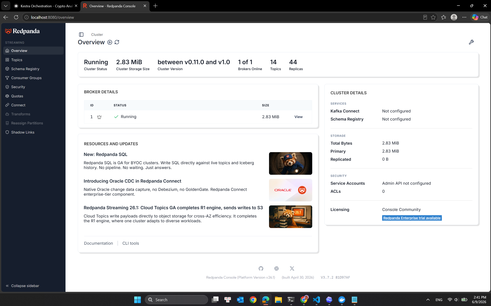

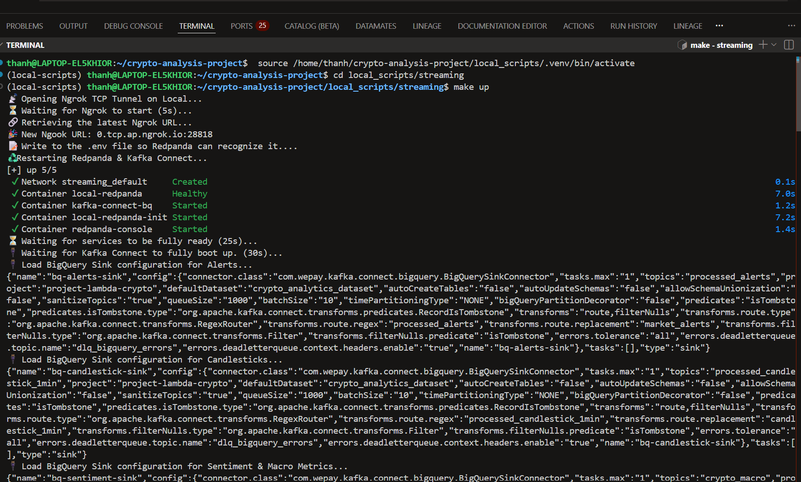
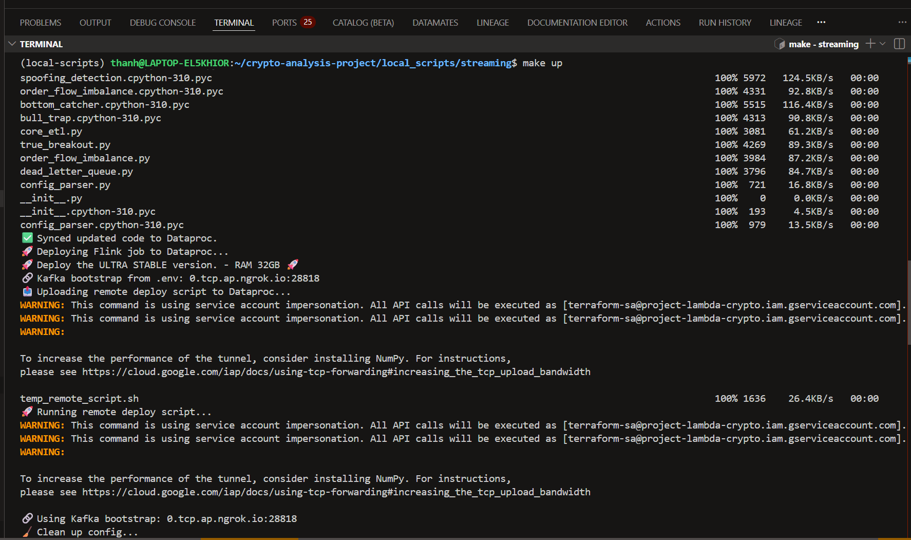
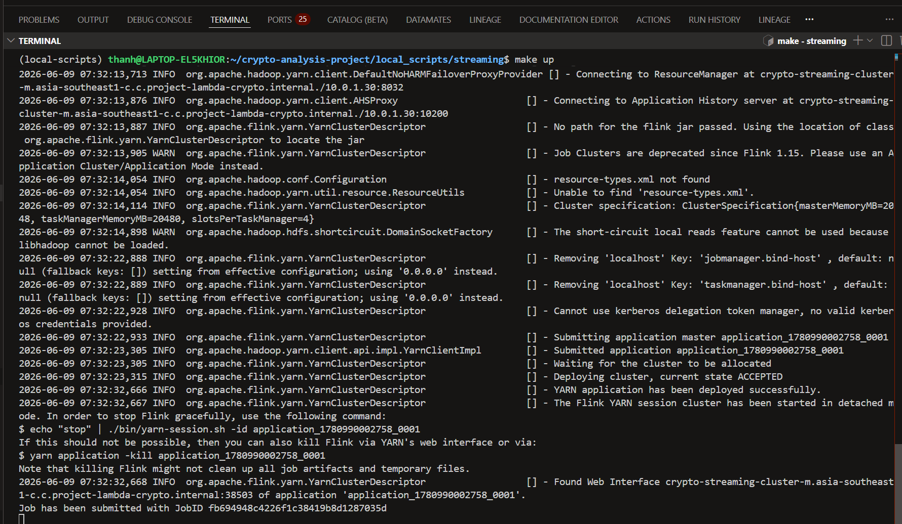

Redpanda Console is mapped by `docker-compose.yaml` to `http://localhost:8080`. Kafka Connect is mapped to `http://localhost:8083`.

3. Start the producer bots after the stack is healthy.

```bash
cd /home/thanh/crypto-analysis-project/local_scripts/streaming
make start_bots
```

The Makefile includes these log viewers:

```bash
make log_binance
make log_onchain
make log_sentiment
```

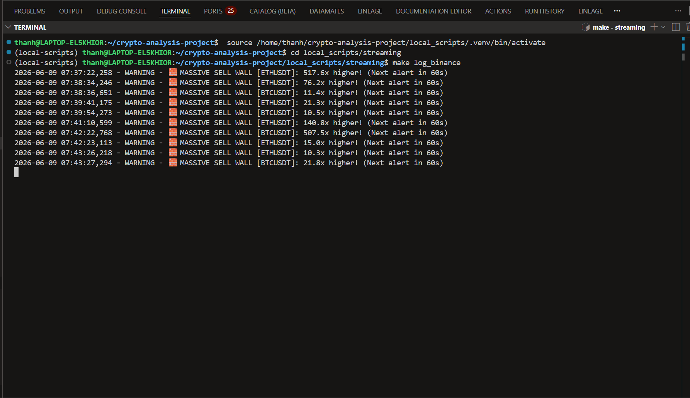
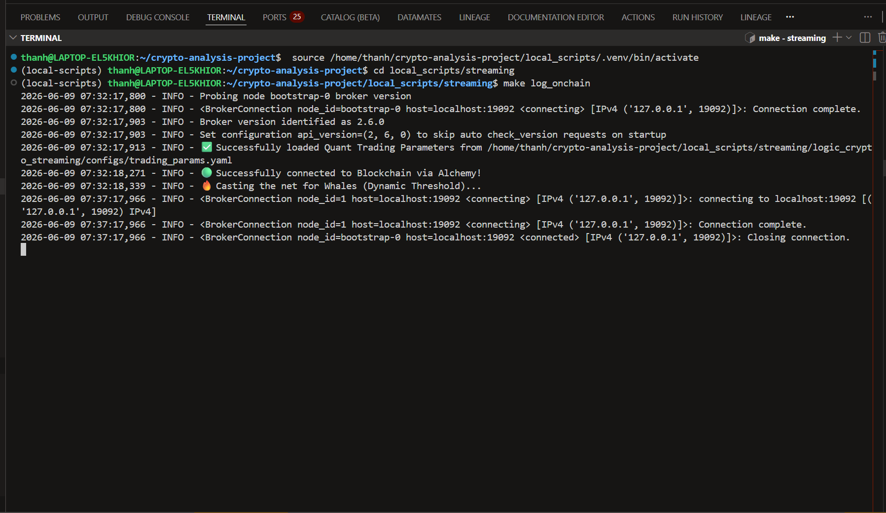
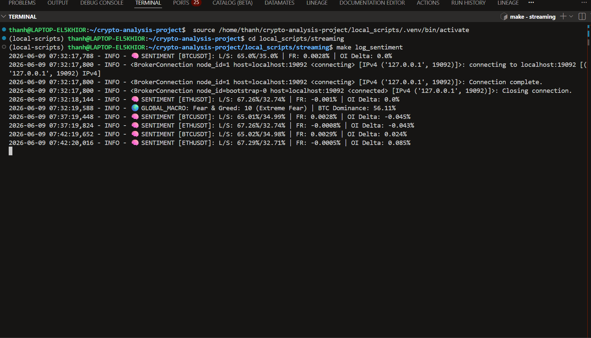

4. Check the cloud streaming job from Google Cloud. The Makefile and deploy script use Dataproc cluster `crypto-streaming-cluster` in zone `asia-southeast1-c`; confirm these values before running in another environment.

Open Cloud Console, then go to Dataproc -> cluster -> VM or web interfaces -> YARN ResourceManager -> application Tracking URL. The Flink job is submitted with `flink run -m yarn-cluster`.

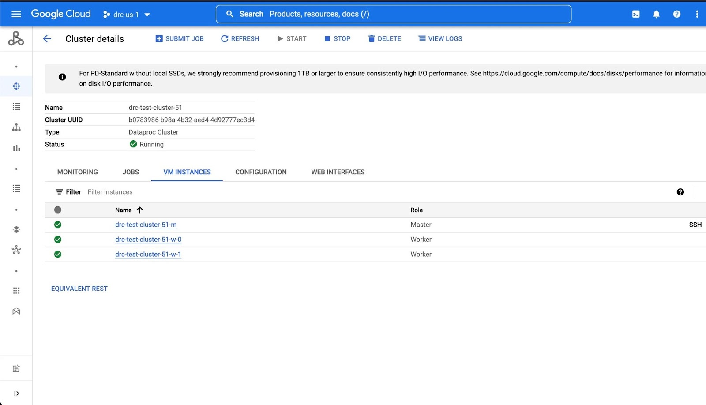

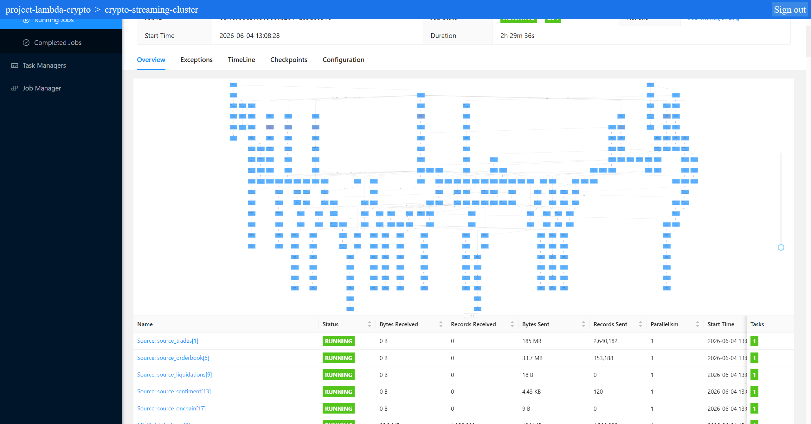

5. Bring up Grafana support if you want the BigQuery dashboard path. The Terraform in `terraform-grafana` creates a BigQuery data source named `GCP-BigQuery-Crypto` and outputs `grafana_dashboard_url`.

```bash
cd /home/thanh/crypto-analysis-project/terraform-grafana
terraform plan
terraform apply
```

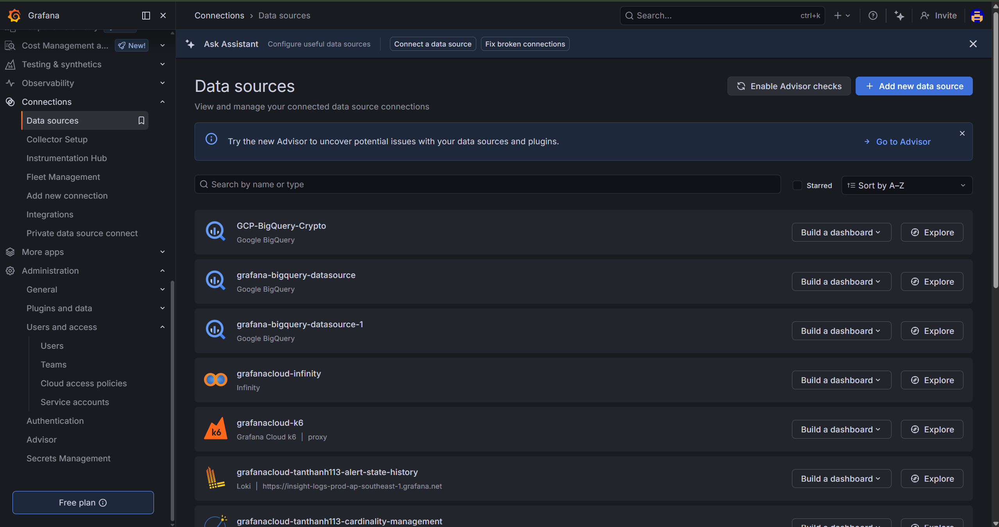

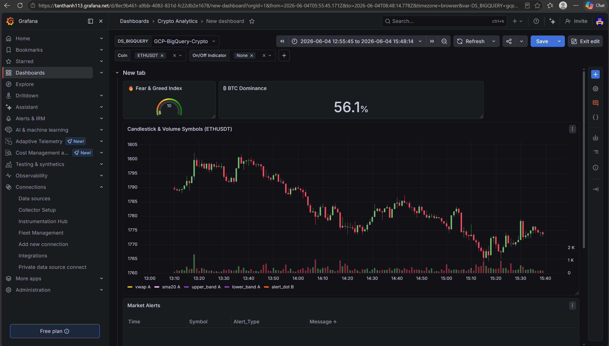

Do not commit Terraform state, `.tfvars`, service account keys, local `.env`, or generated connector credentials.

### Batch / Kestra Pipeline

Batch and orchestration flows live mainly under [local_scripts/batch](local_scripts/batch), [kestra/flows-gke](kestra/flows-gke), [helm/kestra](helm/kestra), and [k8s/kestra](k8s/kestra). Kestra-on-GKE infrastructure is in the main [terraform](terraform) module.

1. Provision or update the required cloud infrastructure only when you intend to operate the environment.

```bash
cd /home/thanh/crypto-analysis-project/terraform
terraform plan
terraform apply
```

2. Add the required Kestra runtime secrets in Google Cloud Secret Manager. Do not put secret values in Git or screenshots.

TODO: confirm the Secret Manager secret names for the target environment before running the sync command.

3. Confirm local tooling and access:

- `gcloud` authenticated to the intended project.
- `kubectl` points to the intended GKE cluster.
- Helm access is configured for the Kestra release.
- The default namespace in the helper script is `kestra`; override `NAMESPACE` if your deployment differs.

4. Sync Kestra runtime secrets into Kubernetes. The helper script exists at [scripts/sync_kestra_k8s_secrets.sh](scripts/sync_kestra_k8s_secrets.sh). Its defaults are `PROJECT_ID=project-lambda-crypto`, `NAMESPACE=kestra`, `K8S_SECRET_NAME=kestra-runtime-secret`, and `HELM_RELEASE=kestra`.

```bash
cd /home/thanh/crypto-analysis-project
uv run scripts/sync_kestra_k8s_secrets.sh
```

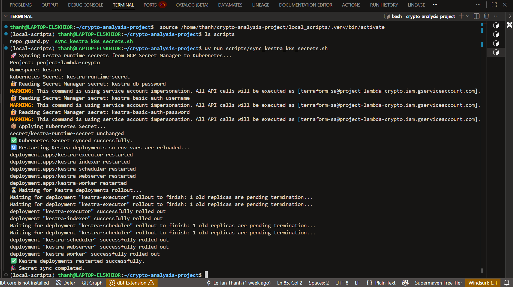

5. Check the Kestra pods in the actual namespace.

```bash
kubectl get pods -n kestra
kubectl rollout status deployment/kestra-webserver -n kestra
```

6. Open the Kestra webserver locally. Existing docs and Helm values use the `kestra` namespace and `kestra-webserver` deployment.

```bash
kubectl port-forward deployment/kestra-webserver 8080:8080 -n kestra
```

Then open `http://localhost:8080`, log in with the configured credentials, and inspect flows, executions, logs, failed tasks, schedules, and namespaces.

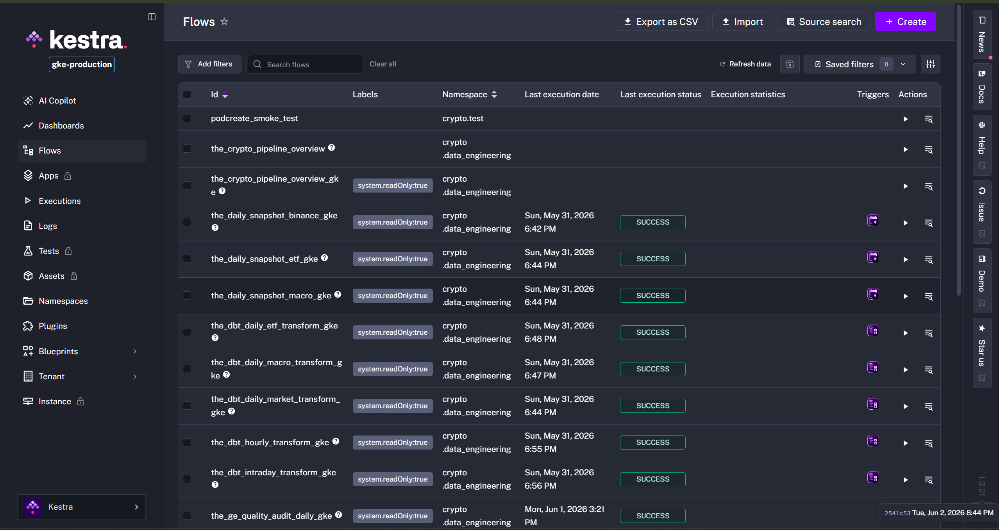

### Cleanup

For the local streaming stack, stop producers and clean up local Docker/ngrok resources from the streaming folder:

1. Stop the producer bots after completing the pipeline.
```bash
cd /home/thanh/crypto-analysis-project/local_scripts/streaming
make stop_bots
```
2. Clean up the local streaming stack.
```bash
cd /home/thanh/crypto-analysis-project/local_scripts/streaming
make down
```

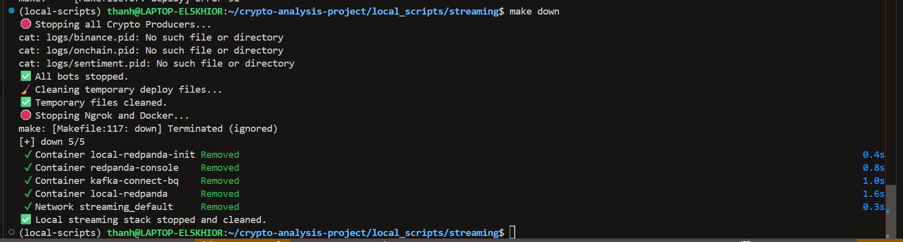

TODO: document the approved cloud teardown policy for Dataproc, Grafana, GKE, Cloud SQL, and Kestra resources. Do not run `terraform destroy` casually.

More detail:

- [docs/streaming_pipeline.md](docs/streaming_pipeline.md)
- [docs/kestra_orchestration.md](docs/kestra_orchestration.md)
- [docs/k8s_gke_runtime.md](docs/k8s_gke_runtime.md)
- [docs/terraform_infrastructure.md](docs/terraform_infrastructure.md)

---

## Looker Studio Dashboard

Live demo:

<https://datastudio.google.com/reporting/4df2ff41-4da8-479d-bf14-6ee4697aa0e7>

This Looker Studio report is a demo dashboard for portfolio review. The live link can be used to quickly explore the dashboard while the original BigQuery tables, Looker Studio data sources, credentials, and cloud resources are still available.

Important: this live report is not a permanent artifact. If the original BigQuery tables, Looker Studio data source, credentials, or cloud resources are deleted to reduce cost, the demo link may stop working or show missing data. For this reason, this repository keeps screenshots and optional exports as stable references. The reproducible source of truth is the dbt/BigQuery mart layer in [dbt_transform/crypto_dbt/models/marts/dashboard](dbt_transform/crypto_dbt/models/marts/dashboard) and [dbt_transform/crypto_dbt/models/marts/ml](dbt_transform/crypto_dbt/models/marts/ml).

The Looker Studio layout is not stored in this repository as fully executable dashboard-as-code. To recreate the dashboard, rebuild the pipeline, build the dbt marts, make a copy of the Looker Studio report, and reconnect the data sources to your own BigQuery marts.


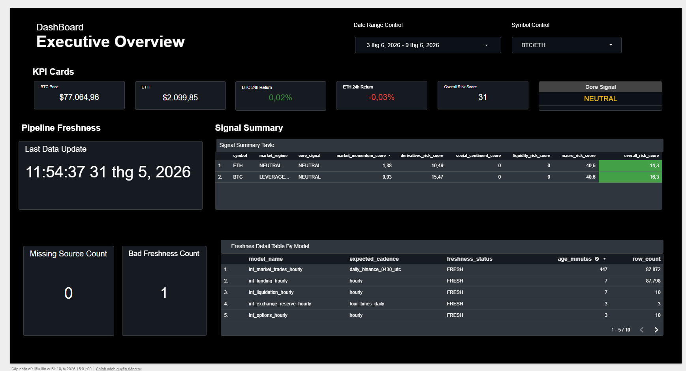

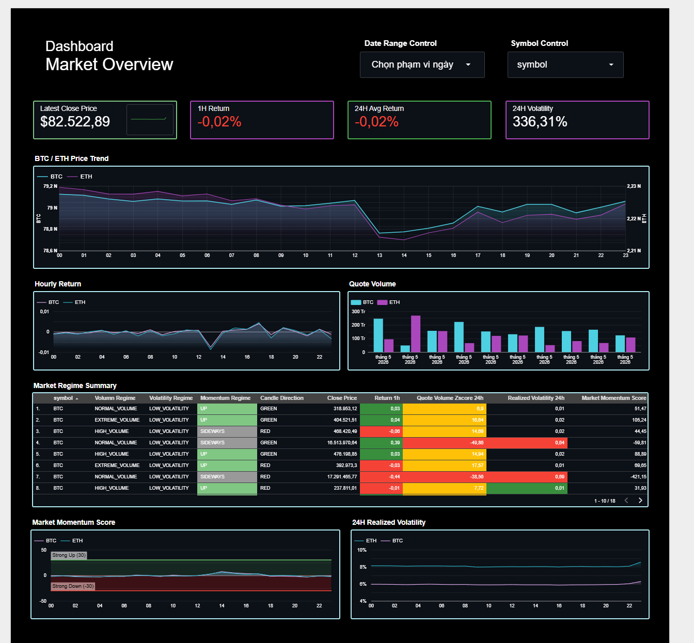

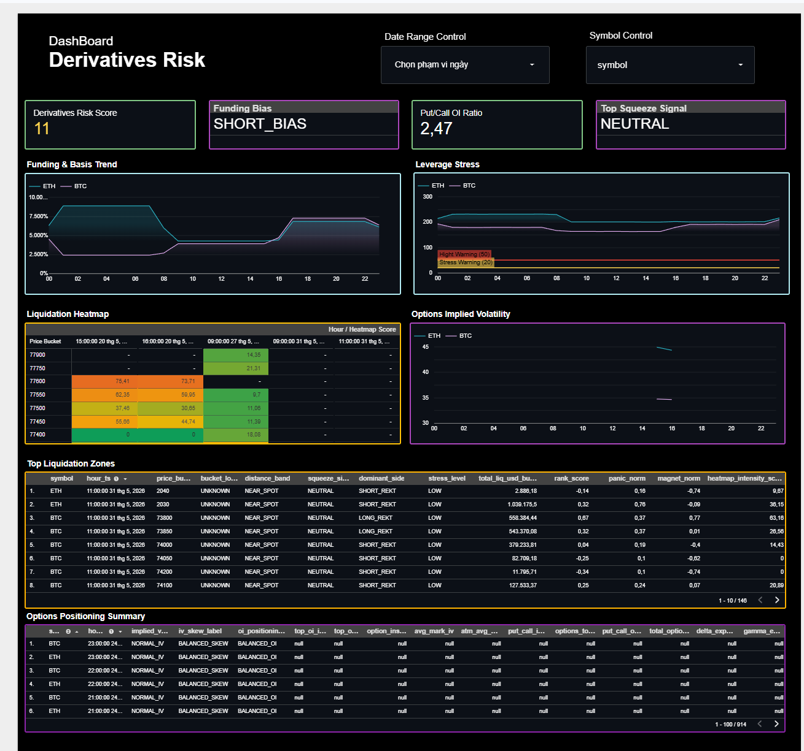

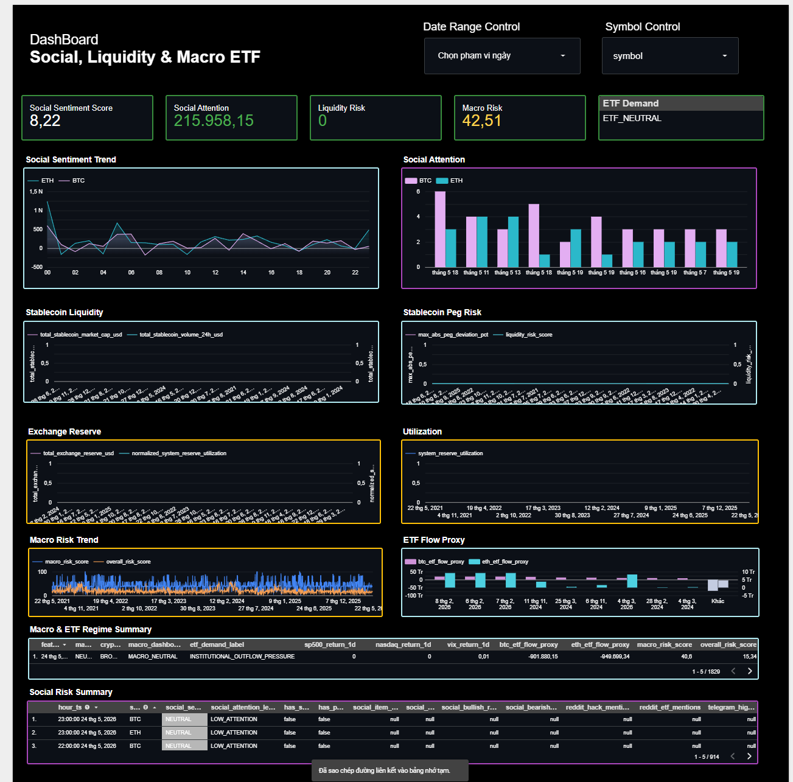

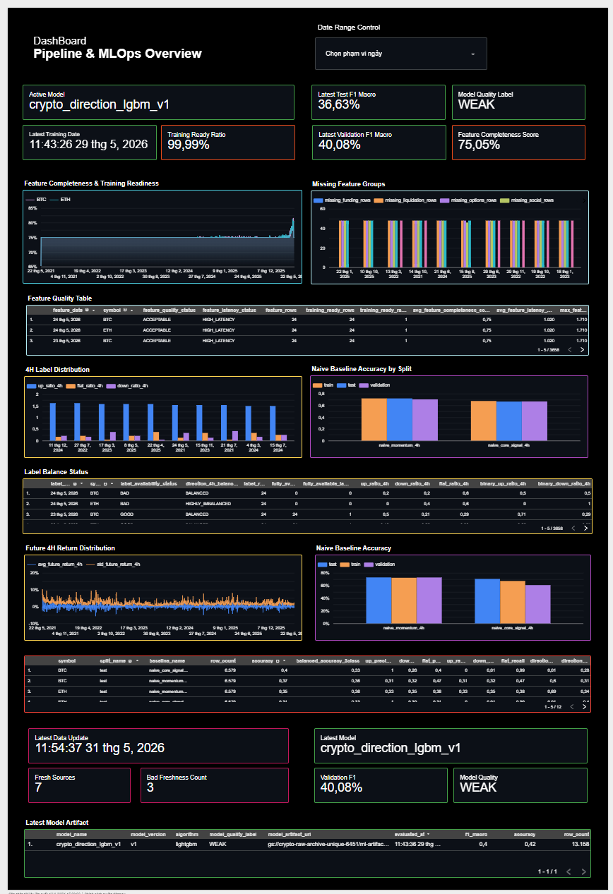

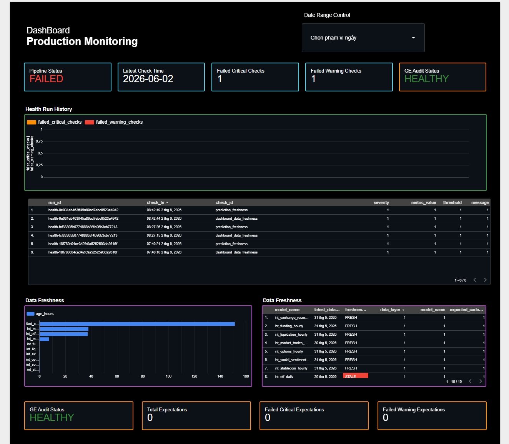

### How to Recreate the Dashboard

1. Deploy required infrastructure only in an environment where cloud cost and credentials are intentionally configured.
2. Run the required ingestion pipelines so the raw/intermediate BigQuery inputs exist.
3. Build the dashboard and ML marts with dbt from `dbt_transform/crypto_dbt`.
4. Open the Looker Studio live report.
5. Use **Make a copy** in Looker Studio.
6. Replace or reconnect every data source to your own BigQuery project/dataset.
7. Point charts to your rebuilt dbt marts.
8. Fix broken fields if your schema, dataset name, project name, or calculated fields differ from the original demo.

Example dbt entrypoint:

```bash
# From the repository root
cd dbt_transform/crypto_dbt
uv run dbt build --select marts.dashboard marts.ml
```

Only run cloud-backed dbt builds when your BigQuery profile and target datasets are intentionally configured.

### Expected BigQuery Marts

The dashboard should be recreated from marts produced by dbt, not from one-off manual tables. Important real model names in this repo include:

- `mart_dashboard_kpi_latest`
- `mart_dashboard_market_overview_hourly`
- `mart_dashboard_derivatives_risk_hourly`
- `mart_dashboard_liquidation_heatmap_hourly`
- `mart_dashboard_social_sentiment_hourly`
- `mart_dashboard_liquidity_risk_daily`
- `mart_dashboard_macro_etf_daily`
- `mart_dashboard_options_risk_hourly`
- `mart_dashboard_alerts_hourly`
- `mart_dashboard_ai_signal_hourly`
- `mart_dashboard_data_freshness`
- `dim_dashboard_metric_catalog`
- `mart_ml_prediction_input_latest`
- `mart_ml_predictions_latest`
- `mart_ml_model_metrics`
- `mart_ml_feature_quality_daily`
- `mart_ml_label_distribution_daily`

TODO: before sharing a copied dashboard publicly, confirm the exact BigQuery dataset names and Looker Studio data source names in your active environment.

### If the Live Dashboard Is Unavailable

If the live Looker Studio report is broken, expired, or disconnected from the original data source, use these repo assets to understand and rebuild it:

- saved screenshots in `docs/looker-studio/images/`
- optional PDF export in `docs/looker-studio/` if present
- dbt dashboard models in `dbt_transform/crypto_dbt/models/marts/dashboard/`
- dbt ML/monitoring models in `dbt_transform/crypto_dbt/models/marts/ml/`
- model schemas in `schema.yml`
- README runbook instructions for ingestion, dbt, and cloud/runtime setup

Do not expose secrets, service account keys, Looker credentials, private data, Terraform state, `.tfvars`, or local `.env` files when recreating or screenshotting the dashboard.

---

## Portfolio Highlights

- Built a cloud-native crypto analytics platform with ingestion, lakehouse storage, dbt marts, orchestration, ML, monitoring, and CI/CD.
- Designed conservative MLOps controls: feature contracts, artifact fallback, optional registry, optional tuning, and promotion gates.
- Implemented local research tooling for AutoML, feature diagnostics, ablation, keeper validation, and production readiness review.
- Added PR-safe deployment patterns for Docker image builds and Kestra flow deployment.
- Documented source coverage limitations and avoided overstating model quality or trading capability.

## AI Assistance Disclosure

This project was built, reviewed, and maintained by [TanThanh113](https://github.com/TanThanh113).

AI tools, including ChatGPT and Codex, were used as learning and productivity assistants during development. The assistance was mainly used for:

* explaining errors and debugging ideas
* reviewing GitHub Actions, Terraform, dbt, Kestra, and MLOps workflow logic
* drafting README, runbook, and pull request documentation
* improving commit messages and pull request descriptions
* suggesting safer CI/CD, cleanup, and deployment patterns

All code, configuration, credentials, cloud resources, architecture decisions, and final changes were reviewed and accepted by the project owner before being committed.

AI-generated suggestions may have been modified, tested, or rejected before inclusion in this repository.

