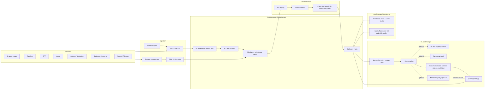
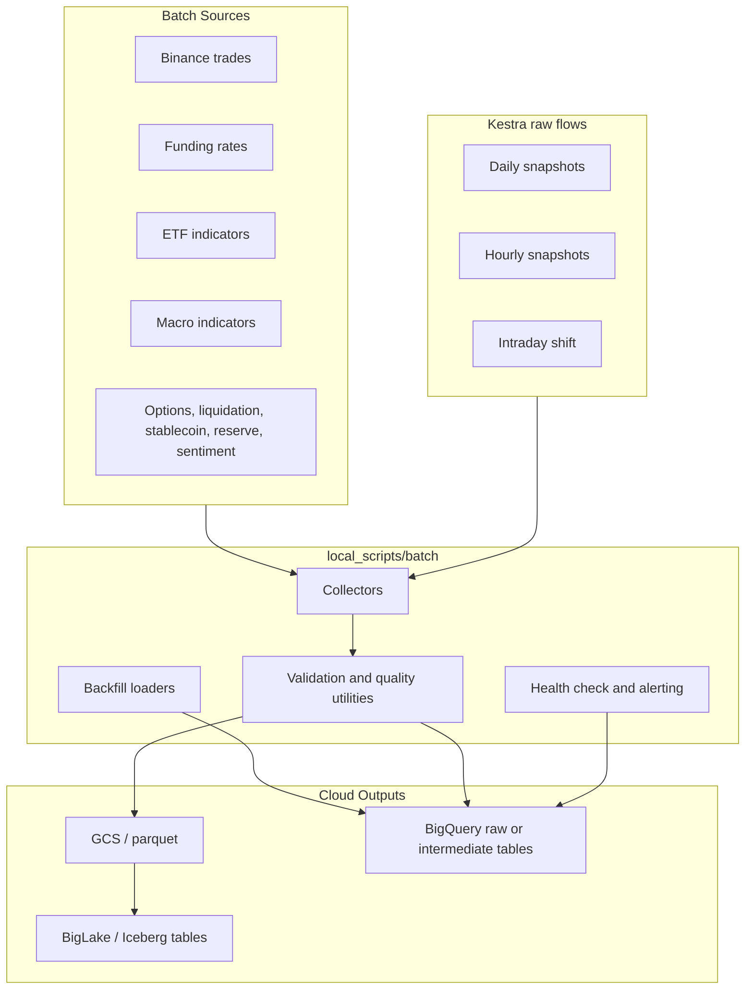
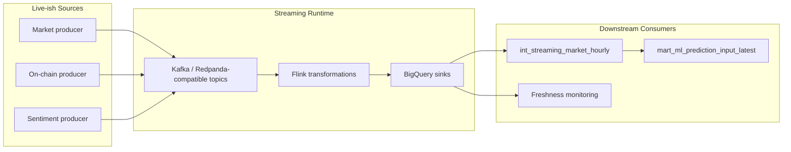
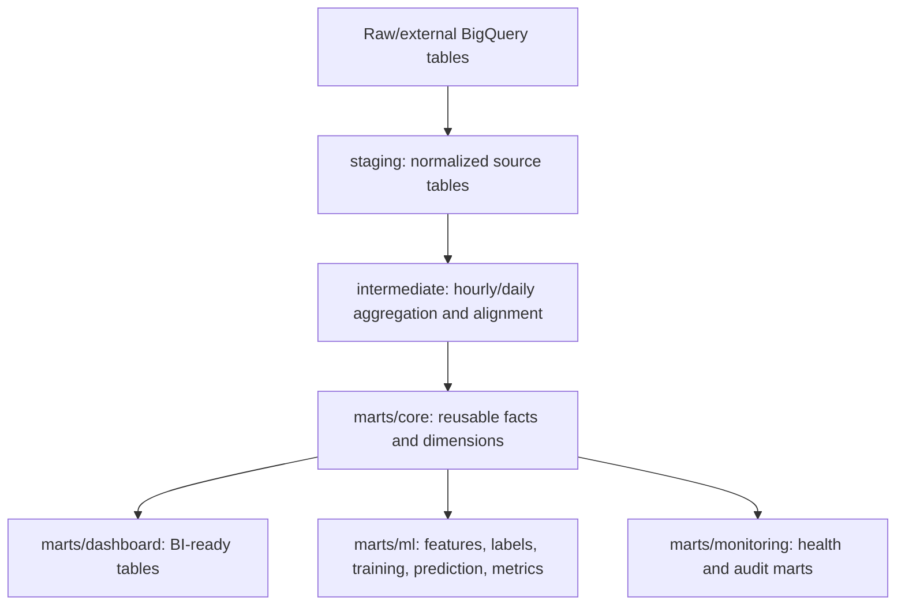
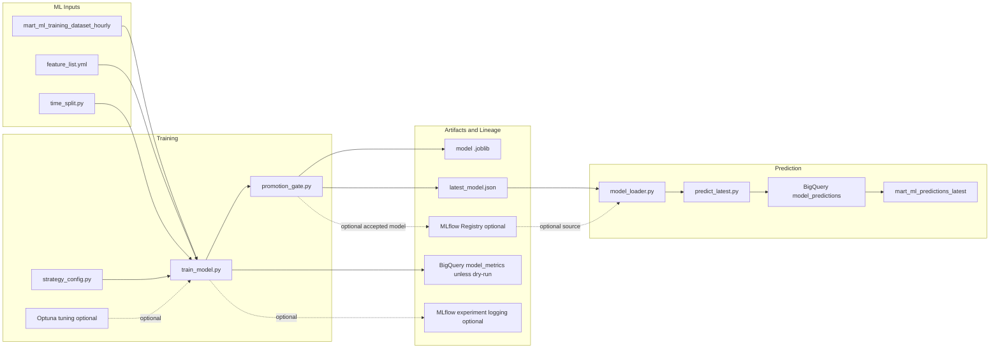
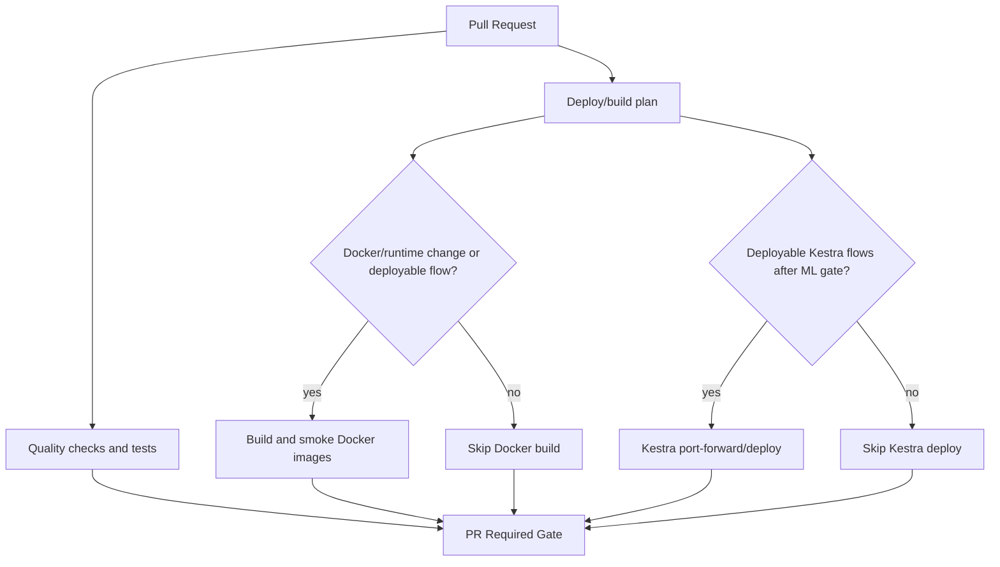

# Project Architecture

This document describes the main architecture of the crypto analytics and ML signal platform. It is intentionally scoped as an analytics and MLOps system, not a trading bot or financial-advice product.

The platform combines batch ingestion, experimental streaming components, GCS/BigLake/BigQuery storage, dbt transformations, Kestra orchestration, Docker/Artifact Registry images, Terraform/GKE infrastructure, ML training/prediction, optional MLflow/Optuna/Registry integration, and monitoring/dashboard marts.

## Current Coverage Note

The most reliable 5-year backfill coverage currently comes from Binance trades, ETF indicators, macro indicators, and funding data. Other sources such as stablecoin, liquidation, options, exchange reserve, Reddit/Telegram sentiment, and live taker-pressure context may be partial, experimental, or not fully live-ready. Model conclusions should be interpreted with this source-coverage limitation in mind.

## High-Level End-to-End Architecture

## Batch Pipeline

The batch path is the most mature ingestion path. Backfill and daily snapshot behavior are intentionally documented separately in [batch_pipeline.md](batch_pipeline.md).

## Streaming Pipeline

The streaming path is useful for freshness and prediction input experiments, but it should be treated as partial until it has the same operational coverage as the trusted batch sources.

## dbt Transformation Layers

The dbt project lives in `dbt_transform/crypto_dbt`. See [dbt_models.md](dbt_models.md) for layer details and ML mart notes.

## ML and MLOps Workflow

Production prediction defaults to the artifact contract. Registry loading is optional and must be explicitly configured. Research scripts under `ml/local_*.py` are local-only investigation tools.

## CI/CD and Deployment Gates

`ENABLE_ML_KESTRA_DEPLOY` controls ML Kestra flow deployment. Batch and dbt flow deployment do not depend on that flag. Docker build gating prevents PRs from building images when neither runtime/image files nor deployable flows changed.

## Infrastructure

Terraform manages core GCP resources such as BigQuery datasets, GCS buckets, Artifact Registry, GKE/Kestra resources, Cloud SQL-backed Kestra configuration, IAM, networking, and related infrastructure. Kestra runtime manifests and Helm values live under `helm/` and `k8s/`.

## Operational Boundaries

- No service account JSON keys should be committed.
- Workload Identity is preferred for cloud runtime authentication.
- Local research artifacts should stay under ignored artifact folders.
- Backfill, deploy, GCS write, BigQuery write, and registry update paths should be run intentionally, not as casual local checks.
