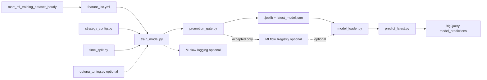

# ML and MLOps

The ML subsystem trains and serves conservative crypto direction signals from dbt ML marts. It is designed around feature-contract consistency, local-first research, optional experiment tracking, optional hyperparameter tuning, optional registry integration, and promotion gates.

Production behavior remains artifact-first and conservative. MLflow, Optuna, and Registry features are optional and disabled unless configured.

## Main Flow



## Core Files

| File | Role |
| --- | --- |
| `train_model.py` | Training entrypoint. Reads BigQuery training data, trains legacy/model-choice or strategy candidates, evaluates splits, writes artifacts, optionally logs MLflow, optionally tunes Optuna, and optionally updates Registry after promotion checks |
| `predict_latest.py` | Prediction entrypoint. Reads latest prediction input, loads artifact/latest model by default, optionally uses Registry source, and writes predictions |
| `feature_list.yml` | Production feature contract and training/prediction config |
| `feature_contract.py` | Computes stable feature-contract hash and metadata for lineage |
| `strategy_config.py` | Defines named training strategies such as logistic baseline and LightGBM rolling windows |
| `time_split.py` | Time-series split and anti-leakage helpers |
| `mlflow_utils.py` | Best-effort optional MLflow experiment logging |
| `optuna_tuning.py` | Optional LightGBM hyperparameter tuning |
| `promotion_gate.py` | Conservative candidate-vs-champion promotion checks |
| `mlflow_registry.py` | Optional MLflow Registry integration using aliases, not deprecated stages |
| `model_loader.py` | Shared loading logic for artifact-first and optional registry-based prediction |
| `local_*.py` | Local research, diagnostics, ablation, keeper validation, and readiness review tooling |

## Training

Default training remains compatible with the original `--model-choice auto` behavior. Strategy mode and strategy matrix mode are opt-in.

Local dry-run example:

```bash
cd /home/thanh/crypto-analysis-project/ml
.venv/bin/python train_model.py \
  --config feature_list.yml \
  --artifact-storage local \
  --artifact-dir artifacts/local_test \
  --dry-run
```

Strategy example:

```bash
cd /home/thanh/crypto-analysis-project/ml
.venv/bin/python train_model.py \
  --config feature_list.yml \
  --strategy lightgbm_rolling_90d \
  --artifact-storage local \
  --artifact-dir artifacts/local_strategy_test \
  --dry-run
```

## Prediction

`predict_latest.py` defaults to the artifact contract:

1. Read `mart_ml_prediction_input_latest`.
2. Load `latest_model.json` and the referenced `.joblib` artifact.
3. Validate feature columns and model metadata.
4. Generate class probabilities and labels.
5. Write predictions when not in dry/safe local mode.

Registry loading is optional and should be enabled only when Registry infrastructure and aliases are intentionally configured.

## Feature Contract

`feature_list.yml` protects train/predict consistency. `feature_contract.py` computes a stable hash from normalized YAML so MLflow logs, artifacts, and audits can show exactly which contract produced a model.

Do not enable research feature subsets in production by casually editing `feature_list.yml`. Additive dbt columns can exist while the production ML contract remains unchanged.

## MLflow

MLflow experiment logging is optional:

- Enabled when `MLFLOW_TRACKING_URI` is set.
- Best-effort by default.
- Does not fail training unless fail-on-error env flags are explicitly enabled.
- Logs params, metrics, tags, feature-contract metadata, and artifacts.

Local-only example:

```bash
export MLFLOW_TRACKING_URI=sqlite:////home/thanh/crypto-analysis-project/ml/artifacts/local_research/mlflow/mlflow.db
export MLFLOW_EXPERIMENT_NAME=crypto_direction_4h_local_automl
export MLFLOW_ARTIFACT_ROOT=file:///home/thanh/crypto-analysis-project/ml/artifacts/local_research/mlflow/artifacts
```

## Optuna

Optuna tuning is optional and off by default. It currently focuses on LightGBM candidates and should be budgeted carefully. Do not tune directly on the test set; model selection should use validation or walk-forward validation, with test retained for final evaluation.

## Promotion Gate

`promotion_gate.py` prevents automatic promotion when a candidate is worse than the current local champion according to configured margins, degradation thresholds, row-count checks, per-class recall checks, and feature completeness checks. Promotion decisions are logged as artifacts and metadata.

## Registry and Fallback

`mlflow_registry.py` is optional and should not be required for normal production prediction. `model_loader.py` keeps prediction robust by supporting artifact-first loading and registry loading only when configured. Deprecated MLflow stages are intentionally avoided.

## Local Research

Local research scripts are intentionally separate from the production path:

- `local_automl_research.py`
- `local_feature_label_diagnostics.py`
- `local_feature_engineering_research.py`
- `local_feature_ablation_research.py`
- `local_down_recall_focus_research.py`
- `local_keeper_candidate_validation.py`
- `local_microstructure_safe_parity_debug.py`
- `local_microstructure_subset_contract_trial.py`

Research artifacts should stay under:

```text
ml/artifacts/local_research/
```

## Current Model Position

The baseline production contract remains active. Microstructure/subset9 improved some DOWN-recall and stability signals in research, but did not clearly beat validation F1 enough to justify default production promotion. The next priority is source coverage and taker-pressure/microstructure reliability before model promotion.
