# Streaming Pipeline

The streaming pipeline is the lower-latency data path for recent crypto market and context signals. It is useful for freshness experiments and future prediction-input automation, but it should be treated as partial/experimental compared with the batch path until operational coverage is stronger.

## What It Does

- Produces market, on-chain, and sentiment messages.
- Routes messages through Kafka/Redpanda-compatible topics in local development.
- Uses Flink-oriented transformation code and sink definitions.
- Feeds BigQuery sink tables and downstream dbt models such as `stg_streaming_candlestick_1min` and `int_streaming_market_hourly`.

## Main Components

| Path | Purpose |
| --- | --- |
| `local_scripts/streaming/producer` | Market, on-chain, and sentiment producers |
| `local_scripts/streaming/logic_crypto_streaming` | Flink/Kafka-oriented transformation logic |
| `local_scripts/streaming/scripts` | BigQuery sink specs and deploy helper scripts |
| `local_scripts/streaming/lib` | Local connector/runtime jars |
| `local_scripts/streaming/docker-compose.yaml` | Local streaming stack support |
| `kestra/flows-gke/streaming/the_streaming_hourly_transform_gke.yml` | GKE-oriented streaming transform orchestration |

## Simplified Flow

```mermaid
flowchart LR
  Producers["Streaming producers"] --> Topics["Kafka / Redpanda topics"]
  Topics --> Flink["Flink transformations"]
  Flink --> BQSinks["BigQuery sinks"]
  BQSinks --> Staging["stg_streaming_candlestick_1min"]
  Staging --> Intermediate["int_streaming_market_hourly"]
  Intermediate --> PredictionInput["mart_ml_prediction_input_latest"]
```

## When To Use Streaming vs Batch

| Use case | Prefer |
| --- | --- |
| Historical training coverage | Batch/backfill |
| Daily and hourly reliable marts | Batch + dbt |
| Recent signal freshness experiments | Streaming |
| Prediction input freshness | Streaming once coverage is reliable |
| Reproducible model research | Cached BigQuery snapshots/local research artifacts |

## Deploy/Run Notes

- Local streaming uses the files under `local_scripts/streaming`.
- GKE orchestration is represented in `kestra/flows-gke/streaming`.
- Do not assume streaming is production-ready just because the flow exists.
- Validate sink schemas, connector credentials, and freshness before tying streaming output to automatic prediction.

## Known Limitations

- Streaming coverage is not yet the trusted full-history path.
- Some live context sources may be partial.
- Prediction automation should wait until freshness and completeness are monitored.
- Streaming jobs can be more operationally sensitive than batch jobs because they rely on topic, connector, sink, and runtime health at the same time.
